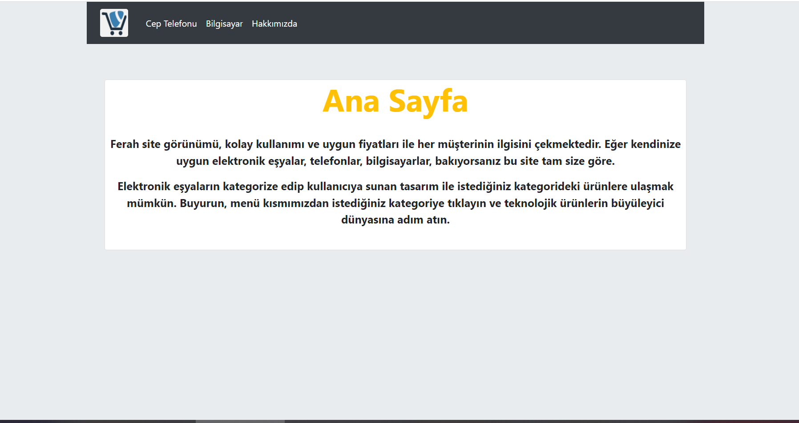
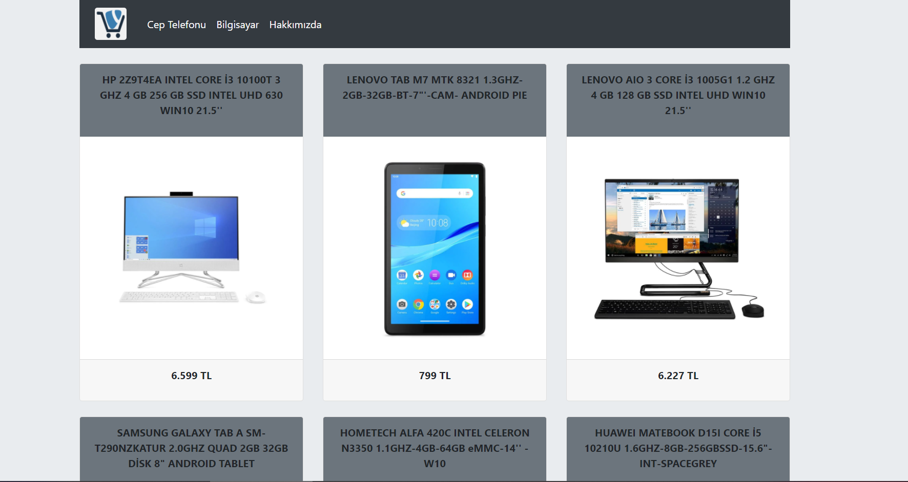

# BOOTSTRAP İLE SİTE TASARIMI 

 Bu projede Bootstrap kullanılarak bir web sitesi yapılmıştır.

Sitede bir e-ticaret sitesi görünümüne ulaşılmaya çalışılmıştır.

Web sitesinin içerisinde;

- Bootstrap'ın container özelliği kullanılmıştır.
- Ayrıca yine Bootstrap'ın card, jumbotron ve navbar özellikleri de kullanılmıştır.

- Faydalanılan site :
    * [https://getbootstrap.com/docs/4.6/getting-started/introduction/](https://getbootstrap.com/docs/4.6/getting-started/introduction/)

## Siteye Ait Görseller

&nbsp;

&nbsp;

&nbsp;

&nbsp;

&nbsp;